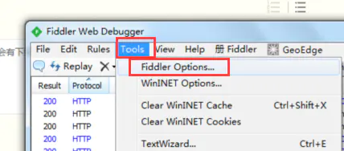
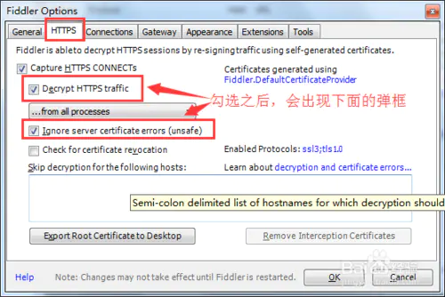
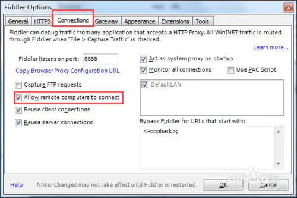

## 一、什么是接口测试？

接口测试是测试系统组件间接口的一种测试（测试浏览器前端与后台的交互）。接口测试主要用于检测系统内部各个子系统之间（会员卡支付，与会员卡之间有一定的交互。京东微信支付，京东调微信支付的接口）、外部系统与系统之间的交互。测试的重点是**要检擦数据交换，传递和控制管理的过程，以及系统间相互逻辑依赖关系等**

通俗来说，接口测试就接口提供方、接口调用方之间交互，及逻辑处理的测试

本质就是发送一个Request报文给服务器，然后服务器响应返回一个Response报文。我们对Response的报文进行分析，判断是否和我们预期一致，从而验证业务是否正确实现。

模拟实际场景（服务架构、数据场景、业务场景），对接口进行模拟调用，验证其相应性能、输出结果、异常处理等测试点

**HTTP 接口测试必须掌握的知识点**

- URL：http[s]://host[:port]\[abs_path]\[parameter]

  例如：http://182.92.178.83:8081/login http协议，182.92.178.83:8081服务器，8081端口，login页面功能

- Header：头信息，包含了报文的描述信息

- Method：请求方法 get/post/delete/put

  - get “?”后面传参，更多为从服务器获取信息

  - post 向服务器提交信息，2人同时修改一个信息，谁最后提交修改为最新的
  - delete 删除
  - put 2人同时提交，第2人提交内容会和第1个人提交的信息，进行提交。如果两人提交的信息一样，不会提交。比如：扫码付款，请求因网络原因没有返回回来，再次扫码付款不会付款成功

- Request Parameters：请求参数

- Response Status：响应状态码

  请浏览附录

## 二、为什么要进行接口测试

接口测试相对于UI来说，更加稳定，也可以说接口测试是一种特殊的单元测试。当一个系统提供了大量的后台服务，有较少或者基本没有页面操作，比较适合开展接口测试。比如某个系统大概有100多个对外接口，每次上线，测试人员不得不一个一个验证，此时如果开展自动化，将大大提高回归的效率和测试的覆盖率。

当用户多时，需要进行接口测试。避免用户绕过前端，直接对接口进行请求。

当用户少时，优先 保证业务使用。

## 三、怎样做接口测试？

开发在写完测试计划之后，在开发接口的同时，拆解功能点，写接口文档。测试人员对照接口文档，边与开发沟通，边测试接口（对照接口文档，做等价类边界值测试）

为提高接口测试效率，及TDD模式，前期我们需要推动开发规范，接口说明文档。

#### 接口测试在工作中的流程

按照接口文档，编写接口的测试用例。

如何获取接口（Charles、Fiddler）

**准备阶段（25%）**

拿到开发的接口文档，并理解每个接口的参数及含义了解被测

**编写接口测试用例	执行阶段（70%）**

测试用例 / 测试场景执行

测试数据 / 系统数据收集

**分析阶段（5%）**

数据汇总 / 日志分析

测试报告

## 四、接口测试用例的设计

**接口测试用例编写要点**

- 测试每个**参数类型不合法**的情况
- 测试每个**参数取值范围不合法**的情况
- 测试**参数为空**的情况
- 测试**参数前后台定义**的一致性
- 测试每个**参数的上下限**(这里容易出致命的BUG, 如果程序处理不当，可能导致崩溃)
- 测试每个**参数取值**不合理的情况(包括取的值不属于自己，取值在这阶段不会出现，取值超出了自己所拥有的数量或者范围)
- 如果两个请求有严格的先后顺序，需要测试调转顺序的情况

## 五、接口测试的流程规范（团队中）

- 与产品、开发一 起梳理需求，确定实现哪些接口和功能
- 编写测试计划(开发人员开发预估时间、风险预估及解决时间，测试人员用例准备、数据准备（测测试数据准备）、环境准备、与开发产品等协调测试等时间)
- 测试计划review。请各部门]再进行沟通，确定最终计划
- 编写用例及自动化脚本
- 用例评审review(以该用例为最终验证的用例)
- 执行测试，提交bug, 验证bug
- 测试总结(包括测试过程、开发过程遇到的问题，解决的问题，小组内讨论以后遇到这种问题如何可以处理更快，对自己启发)

## 六、附录

### HTTP状态码分类

HTTP状态码由三个十进制数字组成，第一个十进制数字定义了状态码的类型，后两个数字没有分类的作用。HTTP状态码共分为5种类型：

| 分类 | 分类描述                                       |
| :--- | :--------------------------------------------- |
| 1**  | 信息，服务器收到请求，需要请求者继续执行操作   |
| 2**  | 成功，操作被成功接收并处理                     |
| 3**  | 重定向，需要进一步的操作以完成请求             |
| 4**  | 客户端错误，请求包含语法错误或无法完成请求     |
| 5**  | 服务器错误，服务器在处理请求的过程中发生了错误 |

HTTP状态码列表:

| 状态码 | 状态码英文名称                  | 中文描述                                                     |
| :----- | :------------------------------ | :----------------------------------------------------------- |
| 100    | Continue                        | 继续。[客户端](http://www.dreamdu.com/webbuild/client_vs_server/)应继续其请求 |
| 101    | Switching Protocols             | 切换协议。服务器根据客户端的请求切换协议。只能切换到更高级的协议，例如，切换到HTTP的新版本协议 |
|        |                                 |                                                              |
| 200    | OK                              | 请求成功。一般用于GET与POST请求                              |
| 201    | Created                         | 已创建。成功请求并创建了新的资源                             |
| 202    | Accepted                        | 已接受。已经接受请求，但未处理完成                           |
| 203    | Non-Authoritative Information   | 非授权信息。请求成功。但返回的meta信息不在原始的服务器，而是一个副本 |
| 204    | No Content                      | 无内容。服务器成功处理，但未返回内容。在未更新网页的情况下，可确保浏览器继续显示当前文档 |
| 205    | Reset Content                   | 重置内容。服务器处理成功，用户终端（例如：浏览器）应重置文档视图。可通过此返回码清除浏览器的表单域 |
| 206    | Partial Content                 | 部分内容。服务器成功处理了部分GET请求                        |
|        |                                 |                                                              |
| 300    | Multiple Choices                | 多种选择。请求的资源可包括多个位置，相应可返回一个资源特征与地址的列表用于用户终端（例如：浏览器）选择 |
| 301    | Moved Permanently               | 永久移动。请求的资源已被永久的移动到新URI，返回信息会包括新的URI，浏览器会自动定向到新URI。今后任何新的请求都应使用新的URI代替 |
| 302    | Found                           | 临时移动。与301类似。但资源只是临时被移动。客户端应继续使用原有URI |
| 303    | See Other                       | 查看其它地址。与301类似。使用GET和POST请求查看               |
| 304    | Not Modified                    | 未修改。所请求的资源未修改，服务器返回此状态码时，不会返回任何资源。客户端通常会缓存访问过的资源，通过提供一个头信息指出客户端希望只返回在指定日期之后修改的资源 |
| 305    | Use Proxy                       | 使用代理。所请求的资源必须通过代理访问                       |
| 306    | Unused                          | 已经被废弃的HTTP状态码                                       |
| 307    | Temporary Redirect              | 临时重定向。与302类似。使用GET请求重定向                     |
|        |                                 |                                                              |
| 400    | Bad Request                     | 客户端请求的语法错误，服务器无法理解                         |
| 401    | Unauthorized                    | 请求要求用户的身份认证                                       |
| 402    | Payment Required                | 保留，将来使用                                               |
| 403    | Forbidden                       | 服务器理解请求客户端的请求，但是拒绝执行此请求               |
| 404    | Not Found                       | 服务器无法根据客户端的请求找到资源（网页）。通过此代码，网站设计人员可设置"您所请求的资源无法找到"的个性页面 |
| 405    | Method Not Allowed              | 客户端请求中的方法被禁止                                     |
| 406    | Not Acceptable                  | 服务器无法根据客户端请求的内容特性完成请求                   |
| 407    | Proxy Authentication Required   | 请求要求代理的身份认证，与401类似，但请求者应当使用代理进行授权 |
| 408    | Request Time-out                | 服务器等待客户端发送的请求时间过长，超时                     |
| 409    | Conflict                        | 服务器完成客户端的 PUT 请求时可能返回此代码，服务器处理请求时发生了冲突 |
| 410    | Gone                            | 客户端请求的资源已经不存在。410不同于404，如果资源以前有现在被永久删除了可使用410代码，网站设计人员可通过301代码指定资源的新位置 |
| 411    | Length Required                 | 服务器无法处理客户端发送的不带Content-Length的请求信息       |
| 412    | Precondition Failed             | 客户端请求信息的先决条件错误                                 |
| 413    | Request Entity Too Large        | 由于请求的实体过大，服务器无法处理，因此拒绝请求。为防止客户端的连续请求，服务器可能会关闭连接。如果只是服务器暂时无法处理，则会包含一个Retry-After的响应信息 |
| 414    | Request-URI Too Large           | 请求的URI过长（URI通常为网址），服务器无法处理               |
| 415    | Unsupported Media Type          | 服务器无法处理请求附带的媒体格式                             |
| 416    | Requested range not satisfiable | 客户端请求的范围无效                                         |
| 417    | Expectation Failed              | 服务器无法满足Expect的请求头信息                             |
|        |                                 |                                                              |
| 500    | Internal Server Error           | 服务器内部错误，无法完成请求                                 |
| 501    | Not Implemented                 | 服务器不支持请求的功能，无法完成请求                         |
| 502    | Bad Gateway                     | 作为网关或者代理工作的服务器尝试执行请求时，从远程服务器接收到了一个无效的响应 |
| 503    | Service Unavailable             | 由于超载或系统维护，服务器暂时的无法处理客户端的请求。延时的长度可包含在服务器的Retry-After头信息中 |
| 504    | Gateway Time-out                | 充当网关或代理的服务器，未及时从远端服务器获取请求           |
| 505    | HTTP Version not supported      | 服务器不支持请求的HTTP协议的版本，无法完成处理               |

### Fiddler抓取手机接口

1. 启动Fiddler，开始设置。点击“tools-->fiddler options”.（有的版本，fiddler options为options）

   

2. 设置HTTPS选项。在设置过程中会有弹框，请允许

   

3. 设置connect选项，记住代理端口号，后面会使用。在设置过程中会有弹框，请允许。设置完之后记得一定要重启Fiddler软件，不然不能使用

   

4. 手机连接电脑的wifi上网，通过ipconfig查看电脑的IP地址

5. 配置手机wifi
6. 此时就可以正常抓取了，如果要抓取HTTPS需要下载一个[FidderRoot certificate证书]()，装在手机中（与服务器严格做对比的APP无法抓取）