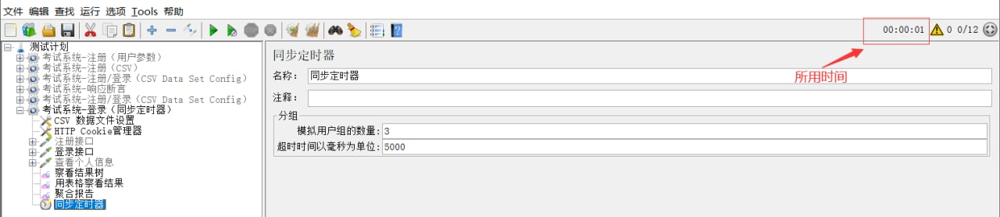

## JMeter 工具使用

### 主要组件介绍

- **测试计划：**使用 JMeter 进行测试的起点，它是其它 JMeter 测试元件的容器。

- **线程组：**代表一定数量的并发用户，它可以用来模拟并发用户发送请求。实际的请求内容在Sampler中定义，它被线程组包含。可以在“测试计划->添加->线程组”来建立它，然后在线程组面板里有几个输入栏：线程数、Ramp-Up Period(in seconds)、循环次数，其中Ramp-Up Period(in seconds)表示在这时间内创建完所有的线程。如有8个线程，Ramp-Up = 200秒，那么线程的启动时间间隔为200/8=25秒，这样的好处是：一开始不会对服务器有太大的负载。线程组是为模拟并发负载而设计。

- **取样器（Sampler）：**模拟各种请求。所有实际的测试任务都由取样器承担，存在很多种请求。如：HTTP 、ftp请求等等。

- **监听器：**负责收集测试结果，同时也被告知了结果显示的方式。功能是对取样器的请求结果显示、统计一些数据（吞吐量、KB/S……）等。

- **断言：**用于来判断请求响应的结果是否如用户所期望，是否正确。它可以用来隔离问题域，即在确保功能正确的前提下执行压力测试。这个限制对于有效的测试是非常有用的。

- **逻辑控制器：**允许自定义JMeter发送请求的行为逻辑，它与Sampler结合使用可以模拟复杂的请求序列。

- **定时器：**负责定义请求（线程）之间的延迟间隔，模拟对服务器的连续请求。

- **配置元件：**维护Sampler需要的配置信息，并根据实际的需要会修改请求的内容。

- **前置处理器和后置处理器：**负责在生成请求之前和之后完成工作。前置处理器常常用来修改请求的设置，后置处理器则常常用来处理响应的数据。

### 测试计划 Test Plan 

用来描述一个性能/接口测试脚本和场景设计，包含与本次测试所有相关的功能。也就是说，使用jmeter进行测试的所有内容都是于基于一个测试计划的。

**测试计划名称和注释：**整个测试脚本保存的名称，和对该测试计划的注释，可以自定义，最好能表达脚本的意义。

**用户定义的变量：**在测试计划上可以添加用户定义的变量，相当于是全局变量。一般添加一些系统常用的配置。如果测试过程中想切换环境，切换配置，**一般不建议在测试计划上添加变量，因为不方便启用和禁用，一般是直接添加用户自定义变量组件**。如下所示：

**独立运行每个线程组： **用于控制测试计划中的多个线程组的执行顺序。不勾选时，默认各线程组并行、随机执行。如下图，线程组1和线程组2的线程是并行执行的，执行过程线程的执行顺序是不可预料的。

如果勾选了独立运行每个线程组，可以保证线程组1的执行一定在线程组2之前，线程组1执行完毕，才会执行线程组2，即顺序执行各线程组。

***补充说明：***

线程组中的取样器的执行顺序：**默认是从上到下执行**。交替控制器、随机控制器、随机顺序控制器和循环控制器等可以改变取样器的执行顺序。

**主线程结束后，运行tearDown线程组（Run tearDown Thread Groups after shutdown of main threads）**

当线程组停止运行时仍继续运行tearDown线程组，该选项结合线程组的执行配置使用

**函数测试模式（Functional Testing）**

 如果选中了此选项，同时监听组件如“查看结果树”配置了保存到一个文件中，那么jmeter会将每次的请求结果保存到文件中。一般不建议勾选。

**添加目录或jar包到classpath（Add directory or jar to classpath）**

添加文件或jar包，此功能最常用于调用外部jar包。当脚本需要调用外部的java文件或jar包时，可以把jar包路径添加到这里，然后在beanshell中直接import进来，并调用jar包中的方法。

### 线程组  Thread Group

一个性能测试请求是基于一个线程组完成的，一个测试计划必须至少有一个线程组。

一个计划中可创建一个或多个线程组，在测试计划中，多个线程组是并行执行的。也就是说这些线程组是同时被初始化并同时执行线程组下的Sampler的

**区域1**

- 继续：继续执行接下来的操作
- Start Next Loop（启动下一进程循环）：忽略错误，执行下一个循环
- 停止线程：退出该线程（不z再进行此线程的任何操作）
- 停止测试：等待当前执行的采样器结束后，结束整个测试
- Stop Test Now：直接停止整个测试

**区域2**

- 线程数：模拟的用户数量。线程数也就是并发数，每个线程将会完全独立的运行测试计划，互不干扰。多个线程用于模仿对服务器的并发访问

- Ramp-up Period（in seconds）：达到指定线程数所需要的时间。`举例：线程数设置为50，此处设置为5，那么
  每秒启动的线程数 = 线程数50/5 = 10`

  当这个值设置的很小、线程数又设置的很大时，在刚开始执行时会对服务器产生很大的负荷

- 循环次数：选中“永远”，则一直循环下去。

- 延迟创建线程直到需要（Delay Thread creation until needed）：当线程需要执行的时候，才会被创建。如果不选择这个选项，那么，在计划开始的时候，所有需要的线程就都被创建好了。

- 调度器：配合区域3说明吧。

**区域3**

- 持续时间（秒）：在此选项填入N，说明这个计划，从某个开始时间算起，执行N秒后结束。（会忽略 结束时间 的选项）
- 启动延迟（秒）：在此选项填入N，手动点击开始执行计划，然后延迟N秒后，计划才真正开始执行。（会忽略 启动时间 的选项）
- 启动时间：当点击开始测试时，将等到此处填写的启动时间，然后真正开始测试。
- 结束时间：当开始测试时，将等到指定的开始时间开始测试，然后会停在此处填写的时间点结束。

调度器

- 如果不想立即执行执行，可以通过调度器控制测试执行的开始时间和结束时间。
- 当测试开始时，如果设置了调度器，JMeter将等待直到到了开始时间。在每个周期结束，JMeter将会检查是否到达结束时间，如果达到，停止运行；否则测试继续运行直到达到了重复限制。

### HTTP请求

### 监听器

监听器(Listener)负责收集测试结果，同时也被告知了结果显示的方式。

我们常用的包括：聚合报告、查看结果树、用表格查看结果，都支持将结果数据写入文件。其他的添加上去看看就行。聚合报告前面我们介绍过，后面是查看结果树和用表格查看结果的截图。

### 用户参数

### 逻辑控制器

**循环控制器**

- 循环控制器可以设置请求的循环次数或永久循环
- 作用：该控制器下的取样器请求可以循环运行

**事务控制器**

- 作用： 事务控制器会生产一个额外的采样器，用来统计该控制器子结点的所有时间。
  在线程组下创建事务控制器
- 参数
  -  Generate parent sample：(选中这个参数结果展示如下图红框，否则显示为下图蓝框)
  - Include duration of timer and pre-post processors in generated sample：选中这一项会统计定时器(timer)的时间，否则只统计采样器(sample)的时间

- 事务控制器可以将对各请求放在同一个事务中。如果选中Generate parent sample，则聚合报告中只显示事务控制器的数据，而不会显示其中的各个请求的数据，反之则全部显示。

### 断言

断言(Assertions)可以用来判断请求响应的结果是否如用户所期望的。它可以用来隔离问题域，即在确保功能正确的前提下执行压力测试。这个限制对于有效的测试是非常有用的。
 两个重要断言：响应断言和JSONAssertion

### 前置/后置处理器

前置处理器(Pre Processors)和后置处理器(Post Processors)负责在生成请求之前和之后完成工作。前置处理器常常用来修改请求的设置，后置处理器则常常用来处理响应的数据。我们主要在动态关联中用到后置处理器的正则表达式提取器。
 [https://www.cnblogs.com/fengpingfan/p/4755411.html](https://links.jianshu.com/go?to=https%3A%2F%2Fwww.cnblogs.com%2Ffengpingfan%2Fp%2F4755411.html)

### 聚合报告

- 样本：并发量

- 平均值：平均响应时间

- 中位数：响应时间的中位数

- 90%百分位：90％的样品不超过此时间。 剩余的样本至少要花这么长的时间。

- 95%百分位：95％的样品不超过此时间。 剩余的样本至少要花这么长的时间。

- 99%百分位：99％的样品不超过此时间。 剩余的样本至少要花这么长的时间。

- 最小值：最小响应时间

- 最大值：最大相应时间

- 异常：本次测试中出现异常的请求的数量/请求的总数量

- 吞吐量：默认情况下表示每秒完成的请求数

  `吞吐量 = 请求总数 / 总花费时间`

- 接收KB/sec：每秒从服务器端接收到的数据量，以kb为计算的单位

- 发送KB/sec：每秒发送到服务器的数据量，以kb为计算的单位

95%响应时间 2、5、8原则，2秒性能很好，5秒可以接受，8秒快不能接受

### 定时器

定时器(Timer)负责定义请求之间的延迟间隔

**同步定时器（Synchronizing Timer）：**相当于一个储蓄池，累积一定的请求，当在规定的时间内达到一定的线程数量，这些线程会在同一个时间点一起并发，可以用来做大数据量的并发请求。

> 值得注意的是模拟用户数量和线程数有关。模拟用户数量为3,代表着3个线程一次发送请求。
>
> 如果用户数不足，将会一直等待（因为设置超时时间为0，0为一直等待时间。单位为ms）

并发开始时间基本相同

**循环并发**

### 图形结果

**作用：**通过图形展示出本次性能测试数据的分布。 图形结果一般作为聚合报告的分析辅佐

- 样本数目：总共发送到服务器的请求数。
- 最新样本：代表时间的数字，是服务器响应最后一个请求的时间。
- 吞吐量：服务器每分钟处理的请求数。
- 平均值：总运行时间除以发送到服务器的请求数。
- 中间值：有一半的服务器响应时间低于该值而另一半高于该值。
- 偏离：表示服务器响应时间变化、离散程度测量值的大小。

### 正则表达式提取

运用Jmeter正则提取器，可以从请求的响应结果中取到需要的内容，从而实现关联。关联是请求与请求之间存在数据依赖关系，需要从上一个请求获取下一个请求需要回传回去的数据
 **正则表达式(regular expression)**描述了一种字符串匹配的模式（pattern），可以用来检查一个串是否含有某种子串、将匹配的子串替换或者从某个串中取出符合某个条件的子串等。

| 字符 | 描述                                                         |
| ---- | ------------------------------------------------------------ |
| *    | 匹配前面的子表达式零次或多次。例如，zo* 能匹配 "z" 以及 "zoo"。* 等价于{0,}。 |
| +    | 匹配前面的子表达式一次或多次。例如，'zo+' 能匹配 "zo" 以及 "zoo"，但不能匹配 "z"。+ 等价于 {1,}。 |
| ?    | 匹配前面的子表达式零次或一次。例如，"do(es)?" 可以匹配 "do" 、 "does" 中的 "does" 、 "doxy" 中的 "do" 。? 等价于 {0,1}。 |
| ( )  | 标记一个子表达式的开始和结束位置。子表达式可以获取供以后使用。 |
| .    | 匹配除换行符 \n 之外的任何单字符。要匹配 . ，请使用 . 。     |

构造正则表达式的方法和创建数学表达式的方法一样。也就是用多种元字符与运算符可以将小的表达式结合在一起来创建更大的表达式。正则表达式的组件可以是单个的字符、字符集合、字符范围、字符间的选择或者所有这些组件的任意组合。

参考

[JMeter5.2基本使用](https://blog.csdn.net/Alice_whj/article/details/105386987)

[JMeter 各种逻辑控制器(Logic Controller)](https://blog.csdn.net/lijing742180/article/details/86514115?ops_request_misc=%257B%2522request%255Fid%2522%253A%2522161832067316780271584883%2522%252C%2522scm%2522%253A%252220140713.130102334.pc%255Fblog.%2522%257D&request_id=161832067316780271584883&biz_id=0&utm_medium=distribute.pc_search_result.none-task-blog-2~blog~first_rank_v2~rank_v29-24-86514115.nonecase&utm_term=jmeter)

[JMeter组件介绍](https://www.jianshu.com/p/a53b149e6e46)